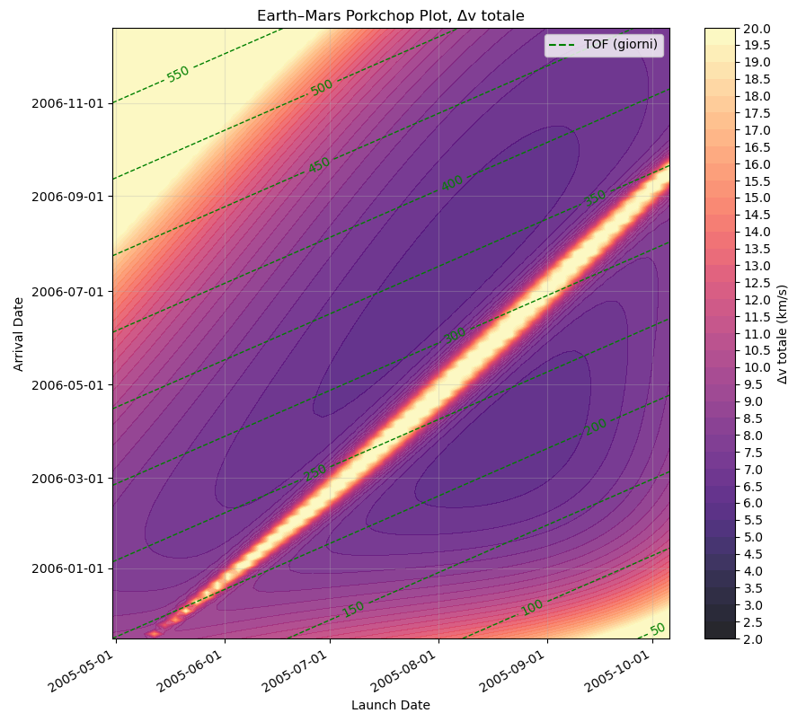
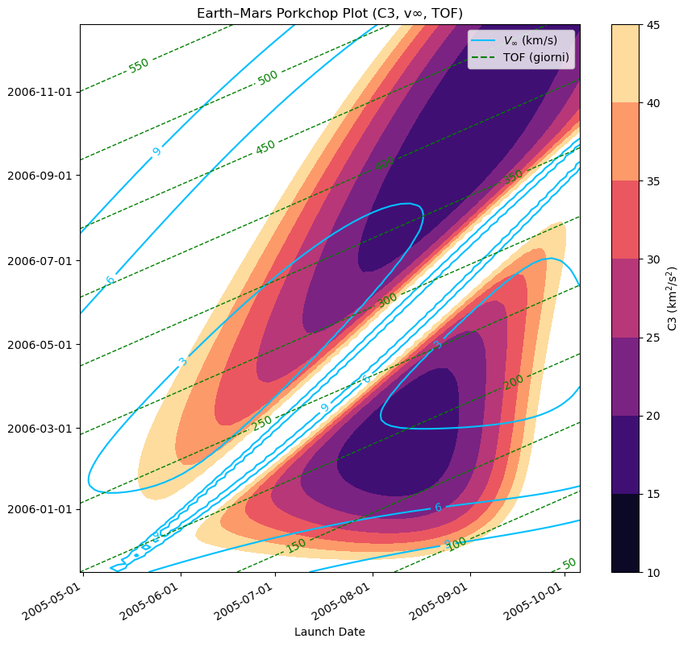
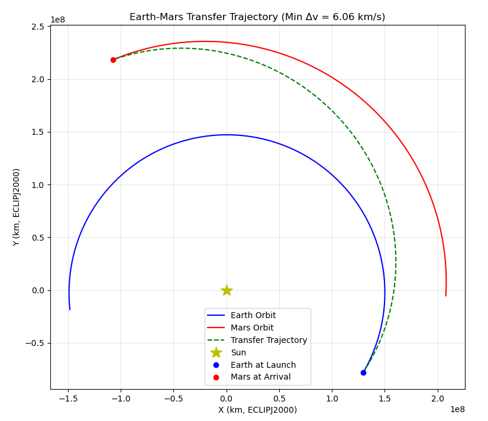
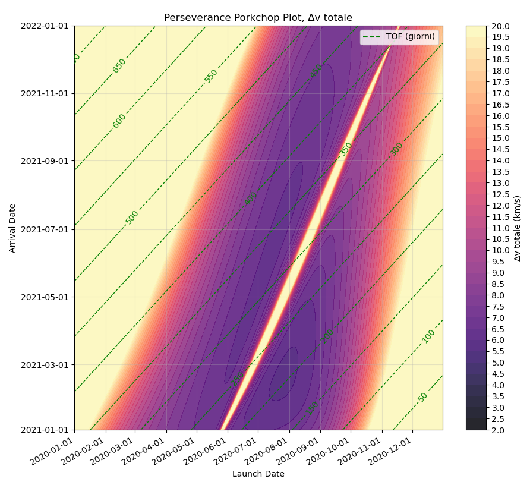
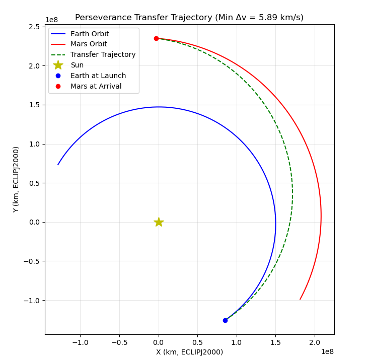

# Bachelor's Thesis: Lambert's Problem and Interplanetary Transfers (Earth–Mars)

**Analysis of Lambert's problem and its application to interplanetary transfers: a study of an Earth–Mars mission**
*(original title: "Analisi del problema di Lambert e applicazione ai trasferimenti interplanetari: studio di una missione Terra-Marte")*

Final thesis for the B.Sc. in Aerospace Engineering, Sapienza University of Rome (Faculty of Civil and Industrial Engineering).
Supervisor: Prof. Alessandro Zavoli.

> 🇮🇹 The thesis document is written in Italian. This README summarizes the work in English.

---

## Contents

| File | Description |
|------|-------------|
| [`BAER___Caroletta.pdf`](./BAER___Caroletta.pdf) | Full thesis (Italian, 7 pages) |
| [`Porkchopplot_generator_thesis.py`](./Porkchopplot_generator_thesis.py) | Python script that generates the porkchop plots and the minimum-Δv transfer trajectory |
| [`images/`](./images) | Figures from the thesis used in this README |

---

## Overview

Lambert's problem consists in finding the Keplerian orbit that connects two position vectors in a prescribed time of flight, and it is a cornerstone of astrodynamics: it is used in rendezvous and interception, orbit determination, preliminary mission design and space debris correlation.

The thesis covers:

1. **Theory**: Lambert's theorem, its derivation from the time-of-flight equation, the Prussing criterion to resolve the quadrant ambiguity of the auxiliary angles, and the computation of terminal velocities through the Lagrange coefficients.
2. **Solution algorithms**: an overview of the main iterative approaches (Bate, Battin & Vaughan, Gooding, Izzo, Simó), compared by iteration variable, iteration scheme, initial guess and velocity reconstruction.
3. **Case study**: a numerical model for the Earth–Mars transfer, used to generate porkchop plots and identify optimal launch windows.

## Method

For each (launch date, arrival date) pair on a grid, the script:

1. Retrieves the heliocentric positions and velocities of Earth and Mars from NASA's **SPICE** toolkit (`spiceypy`, DE440s ephemerides, `ECLIPJ2000` frame).
2. Solves Lambert's problem with the **`pykep`** solver (Izzo's algorithm) for the corresponding time of flight.
3. Computes the departure characteristic energy **C₃** and the arrival hyperbolic excess speed **v∞,arr** from the Lambert and planetary velocities.
4. Estimates the total **Δv** for a transfer from a circular **300 km LEO** around Earth to a circular **200 km orbit** around Mars, as the sum of the departure and arrival burns.
5. Plots the results as porkchop plots (C₃, v∞,arr, TOF and total Δv contours) and propagates the minimum-Δv transfer orbit.

## Results

The model was validated in two ways.

**1. Comparison with the literature (2005 launch window)**
Results were compared with the JPL *Interplanetary Mission Design Handbook* (Sergeyevsky et al., 1983). The shapes and distributions of the C₃, v∞ and TOF contours, as well as the numerical values, are in good agreement with the reference data.

- Minimum Δv (short-arc solution): **6.06 km/s**
- Launch → arrival: **22 Aug 2005 → 27 Mar 2006**

<p align="center">
  
  
</p>
<p align="center"><em>Porkchop plots for the 2005 window: total Δv with TOF contours (left); C₃ with arrival v∞ and TOF contours (right). Plot labels are in Italian ("giorni" = days, "Δv totale" = total Δv).</em></p>

<p align="center">
  
</p>
<p align="center"><em>Minimum-Δv transfer trajectory (Δv = 6.06 km/s), ecliptic plane (ECLIPJ2000).</em></p>

**2. Comparison with a real mission (NASA Perseverance, 2020 window)**

| | Launch | Arrival | TOF |
|---|---|---|---|
| **Actual mission** | 30 Jul 2020, 11:50 UTC | 18 Feb 2021, 20:55 UTC | ~203 days |
| **Model (minimum Δv = 5.89 km/s)** | 27 Jul 2020 | 19 Feb 2021 | 207 days |

The optimal dates found by the model are very close to those actually chosen for the mission.

<p align="center">
  
  
</p>
<p align="center"><em>Perseverance 2020 window: total Δv porkchop plot with TOF contours (left) and minimum-Δv transfer trajectory, Δv = 5.89 km/s (right).</em></p>

The porkchop plots also show the characteristic split between **short-arc** (Δν < 180°) and **long-arc** (Δν > 180°) solutions, with the latter corresponding to longer flight times.

## Limitations

The model is based on Keplerian (two-body) assumptions and is intended as a **preliminary mission design tool**. It does not account for:

- perturbative effects,
- gravity-assist maneuvers required by more complex missions.

In the script, only the zero-revolution Lambert solution is considered, and planetary states are taken from the Earth and Mars barycenters.

## Running the script

### Requirements

- Python 3
- `numpy`, `matplotlib`, `spiceypy`, `pykep`

```bash
pip install numpy matplotlib spiceypy pykep
```

### SPICE kernels

The kernels are **not included** in this repository. Download them from the [NAIF website](https://naif.jpl.nasa.gov/naif/data.html) and update the `spice.furnsh(...)` paths at the top of the script (they currently point to a local path):

- `Gravity.tpc`: gravitational constants (GM)
- `naif0012.tls`: leap seconds kernel (LSK)
- `de440s.bsp`: planetary ephemerides (SPK)

### Configuration

Launch and arrival windows, time step and cutoff values (C₃, v∞, Δv) are set at the top of the script. The version in this folder is configured for the **Perseverance 2020 window**. To reproduce the 2005 literature comparison, change `launch_start_day`, `launch_end_day`, `arrival_start_day` and `arrival_end_day` accordingly.

```bash
python Porkchopplot_generator_thesis.py
```

The script displays three figures (C₃/v∞/TOF porkchop plot, Δv porkchop plot, minimum-Δv transfer trajectory) and prints the minimum Δv with the corresponding launch date, arrival date and TOF.

## References

1. Fantino, E. and de la Torre Sangrà, D., *Review of Lambert's Problem*, 25th Int. Symp. on Space Flight Dynamics (ISSFD), 2015.
2. Izzo, D., *Revisiting Lambert's Problem*, Celestial Mechanics and Dynamical Astronomy, vol. 121, pp. 1–15, 2015.
3. Toglia, C., Master's thesis, Politecnico di Torino, 2006.
4. Qadir, K., *Multi Gravity Assist Trajectory Design Tool*, Master's Thesis, University of Southampton, 2010.
5. Sergeyevsky, A.B., Snyder, G.C. and Cunniff, R.A., *Interplanetary Mission Design Handbook, Volume I, Part 2: Earth to Mars Ballistic Mission Opportunities, 1990–2005*, JPL Publication 82-43, 1983.

## Author

**Francesco Caroletta**
[LinkedIn](www.linkedin.com/in/francesco-caroletta-a569852a6) [Email](mailto:Francecaroletta@gmail.com) [@FrancescoCaro](https://github.com/FrancescoCaro)
