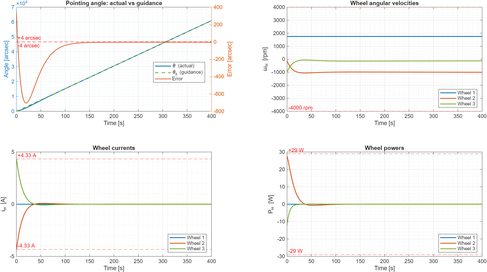
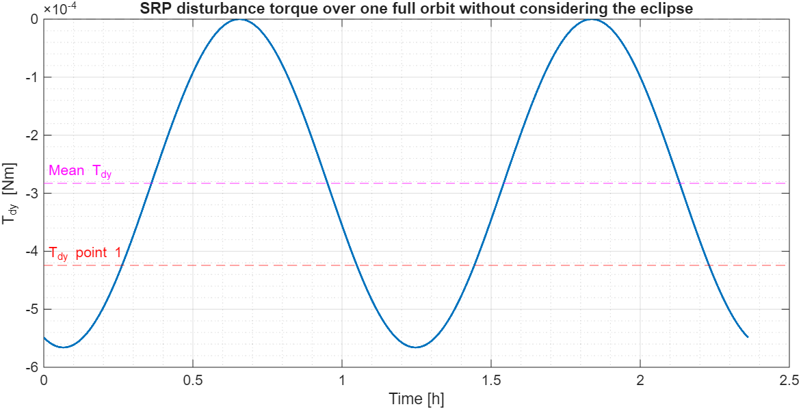
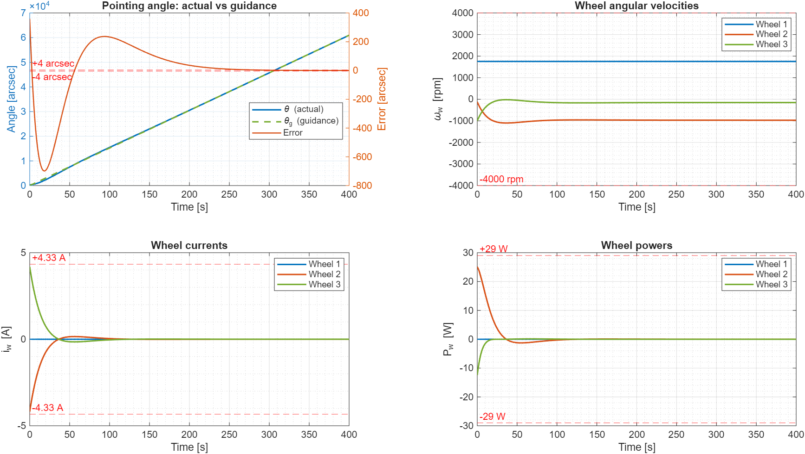

# Reaction-Wheel Attitude Control for a Mercury-Orbiting Spacecraft

Pitch-axis attitude control of a BepiColombo-like spacecraft in a low circular polar orbit around Mercury, using a tetrahedral reaction-wheel array under **solar radiation pressure (SRP)** disturbance torque. The project covers control design, actuator constraint checking (torque, current, power, speed), and an eclipse-aware estimate of **how long the wheels can hold nadir pointing before saturating**.

Coursework for *Space Missions and Systems* (Homework 2, 2026). Implemented in MATLAB; the full derivation and discussion are in the accompanying report ([`Caroletta_Homework_2_SMS.pdf`](Caroletta_Homework_2_SMS.pdf)).



## Highlights

- Closed-loop **PD design** by parametric search, meeting a **±4 arcsec** pointing tolerance within **300 s** while respecting every wheel constraint.
- **PID redesign** (with anti-windup) when the disturbance becomes time-varying and the PD structure can no longer satisfy the requirements.
- **Eclipse-aware wheel saturation analysis**: an analytical momentum-budget formula for constant torque and an event-driven numerical integration for the time-varying case.
- Realistic actuator model: torque saturation, wheel electrical model (current and power), speed limits.

## Scenario

- Circular polar orbit, radius 3430 km around Mercury (non-rotating, fixed in space), Sun direction fixed along $\hat X_{ICRF}$ at 0.41 AU.
- Nominal attitude: nadir pointing ($\hat Z_B$ toward Mercury's centre, $\hat X_B$ along-track). At $t=0$ the spacecraft is 0.1° away from nadir and not rotating.
- Disturbance: SRP on the solar panels, with the centre of pressure 2 m from the body-frame origin along the panel direction. Gravity gradient is neglected and the torque vanishes in eclipse.
- Actuators: four reaction wheels in tetrahedral configuration, of which the first three are used for control.
- Three cases are analysed:
  1. Panels held at a constant angle to the Sun ($\alpha = -120°$): design a controller reaching nadir pointing within tolerance in 5 minutes.
  2. Time the wheels can sustain nadir pointing before saturation, with and without eclipses.
  3. Panels fixed in the body frame (offset $-100°$ from $\hat X_B$), which makes the SRP torque vary along the orbit.

## Modelling

**Attitude dynamics** (single pitch axis, angle $\theta$):

$$
I\,\ddot\theta = T_{d} + T_c, \qquad T_c = -K_p(\theta-\theta_g) - K_d(\dot\theta-\dot\theta_g)\;\;[-K_i\!\int\!(\theta-\theta_g)\,dt]
$$

- **Guidance** for nadir pointing in a circular orbit: $\theta_g = n\,t$, $\dot\theta_g = n$, with $n=\sqrt{\mu_M/r^3}$.
- **SRP force** on a flat panel with specular fraction $C_s$, normal $\hat n$ and Sun direction $\hat X_{ICRF}$:

$$
\vec F_{SRP} = -\frac{\Phi}{c}\left(\frac{1\,\text{AU}}{D}\right)^{2} A\,(\hat n\cdot\hat X_{ICRF})\Big[(1-C_s)\hat X_{ICRF} + 2C_s(\hat n\cdot\hat X_{ICRF})\hat n\Big]
$$

  and $\vec T_d = \vec b \times \vec F_{SRP}$ with $\vec b = b\,\hat S$. With the panels fixed in the body frame, the panel direction follows the spacecraft attitude, so $T_{dy}$ depends on $\theta$.
- **Torque distribution:** the control torque is split among the wheels through the inverse of the mounting matrix. For a pure pitch torque this gives $T_{w1}=0$, $T_{w2}=-T_c$, $T_{w3}=T_c$, so wheel 1 keeps a constant speed.
- **Wheel dynamics and electrics:** $\dot\omega_{w2}=-T_c/I_w$, $\dot\omega_{w3}=T_c/I_w$; current $i=T_w/K_M$; power $P=(K_W\,\omega_w + R\,i)\,i$.
- **Constraints checked:** $|T_c|\le 0.511$ Nm (equivalent to $|i|\le 4.33$ A), $|P|\le 29$ W, $|\omega_w|\le 4000$ rpm, and pointing error $\le 4$ arcsec for all $t\ge 300$ s.
- **State vector:** $[\theta,\ \dot\theta,\ \omega_{w1},\ \omega_{w2},\ \omega_{w3}]$, plus the error integral for the PID.

## Control design

**PD (case 1).** The gains are tied together through a critically damped second-order response ($\zeta=1$):

$$
\omega_n^2 = \frac{K_p}{I}, \qquad K_d = 2\zeta\sqrt{K_p I}
$$

$K_p$ is swept over a logarithmic grid (`logspace`); each candidate is simulated and the first one that satisfies all the constraints is kept.

**PID (case 3).** With the time-varying disturbance no $(K_p, K_d)$ pair satisfied the constraints, so a PID is used with all three closed-loop poles placed at $-\omega_n$:

$$
K_p = 3 I \omega_n^2, \qquad K_d = 3 I \omega_n, \qquad K_i = I \omega_n^3
$$

The search runs over $\omega_n$ on a logarithmic grid. The integrator uses **conditional integration (anti-windup)**: it is frozen whenever the torque is saturated and the error would push it further into saturation. The pointing error is wrapped to $[-\pi, \pi]$.

## Wheel saturation analysis

- **Constant disturbance, no eclipse:** in steady state $T_c=-T_{dy}$, so the wheel momentum grows linearly at rate $T_{dy}$ and saturation occurs at $h_{sat}=I_w\,\omega_{max}$:

$$
t_{sat} = t_{end} + \frac{h_{sat} - h_w(t_{end})}{T_{dy}}
$$

- **With eclipses:** the shadow is modelled as a cylinder, so the eclipse spans the true anomalies $\pi \mp \arcsin(R_M/r)$ measured from the Sun direction. The momentum budget is then split into a first partial sunlit arc, one eclipse, a number of complete orbits and a final partial arc where saturation occurs.
- **Time-varying disturbance:** numerical integration with `ode113` and a terminal **event function** that stops the simulation when either active wheel reaches its speed limit (up to 100 orbits).

## Results

| Case | Quantity | Value |
|---|---|---|
| 1 | Disturbance torque $T_{dy}$ | $-4.24\times10^{-4}$ Nm |
| 1 | PD gains | $K_p = 22.23$, $K_d = 760.25$ |
| 2 | Wheel 2 saturation, no eclipse | 40 368.63 s |
| 2 | Wheel 3 saturation, no eclipse | 52 090.15 s |
| 2 | Eclipse entry / duration | 3180.60 s / 2142.23 s |
| 2 | **Nadir pointing sustained (with eclipse)** | **53 221.99 s ≈ 14.78 h ≈ 6.26 orbits** |
| 3 | $T_{dy}$ over one orbit (mean / min) | $-2.83\times10^{-4}$ / $-5.66\times10^{-4}$ Nm |
| 3 | PID gains | $K_p = 27.64$, $K_d = 734.16$, $K_i = 0.347$ |
| 3 | **Nadir pointing sustained (with eclipse)** | **67 082.60 s ≈ 18.63 h ≈ 7.89 orbits** |

In both cases wheel 2 is the first to saturate. In case 1 the eclipse extends the holding time from about 11.2 h to 14.78 h. In case 3 the mean SRP torque over an orbit is smaller in magnitude than in the constant-torque case ($-2.83\times10^{-4}$ vs $-4.24\times10^{-4}$ Nm), so the wheels last longer.

**Case 1: PD controller.** Pointing error, wheel speeds, currents and powers stay within the limits (dashed red lines); the initial transient peaks just below the 29 W limit.


**Case 3: disturbance torque over one orbit** (no eclipse), which varies periodically as the panel rotates with the spacecraft:



**Case 3: PID controller** under the variable disturbance:



## Running the code

Requirements: **MATLAB R2018b or later** (uses `yline` and local functions in scripts). No additional toolboxes are needed.

From the MATLAB command window, in the project folder:

```matlab
Homework2_Caroletta
```

or from a terminal:

```bash
matlab -batch "Homework2_Caroletta"
```

The script prints the results of points 2 and 3 to the console (desaturation times, eclipse timing, PID gains, saturation time and wheel speeds) and produces three figures: the PD acquisition case, the PID acquisition case and the SRP torque over one orbit. The long-horizon saturation simulation (up to 100 orbits with tight ODE tolerances) is the most time-consuming part.

## Code structure

`Homework2_Caroletta.m` is a single script organised in sections:

| Section | Content |
|---|---|
| Parameters | Orbit, SRP, wheel and electrical constants |
| SRP disturbance torque | Constant-torque case (panels at fixed angle to the Sun) |
| Point 1 | PD dynamics function, gain search, constraint checks, plots |
| Point 2 | Momentum budget with and without eclipses |
| Point 3 | Variable SRP torque function, PD attempt, PID dynamics and search, orbit torque statistics, event-driven saturation simulation |

## Assumptions and limitations

- Single-axis (pitch) rigid-body model: no cross-coupling with roll and yaw, and no gyroscopic effects.
- Ideal sensing and actuation; no noise, delays or wheel friction.
- Gravity gradient neglected, Mercury fixed and non-rotating, constant Sun direction.
- Cylindrical eclipse model; no penumbra.
- Momentum desaturation manoeuvres are not simulated; the analysis gives the time until they would be needed.
- Gains are chosen by a first-feasible search over a grid, not by an optimisation of a cost function.

## Repository contents

| File | Description |
|---|---|
| `Homework2_Caroletta.m` | MATLAB simulation and analysis script |
| `Caroletta_Homework_2_SMS.pdf` | Report with derivations, results and discussion |
| `figures/` | Figures used in this README (extracted from the report) |

## Author

**Your Name** · [LinkedIn](https://www.linkedin.com/in/your-profile) · [GitHub](https://github.com/FrancescoCaro)
