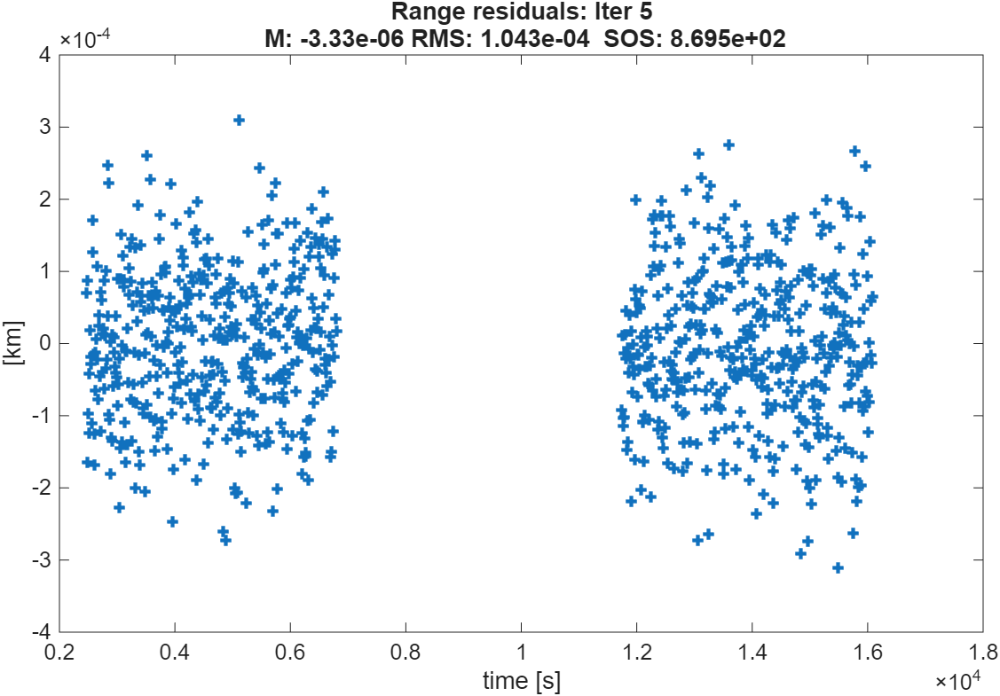
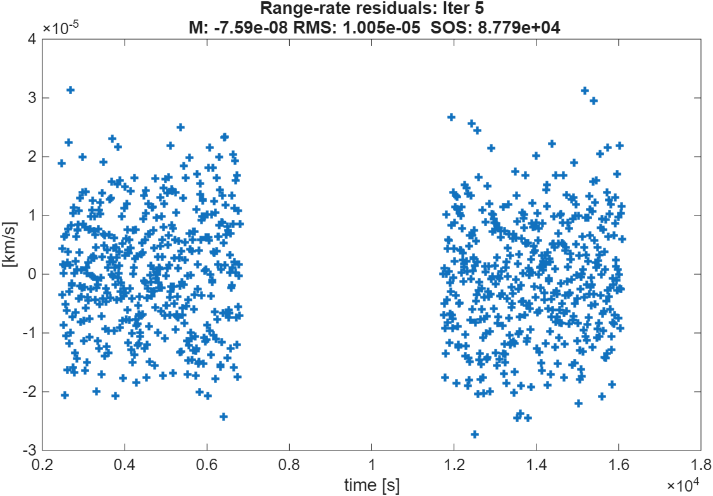
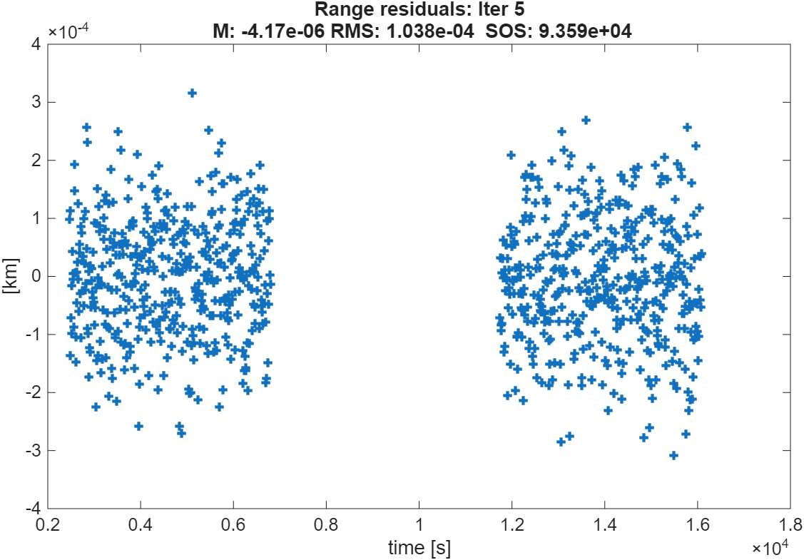
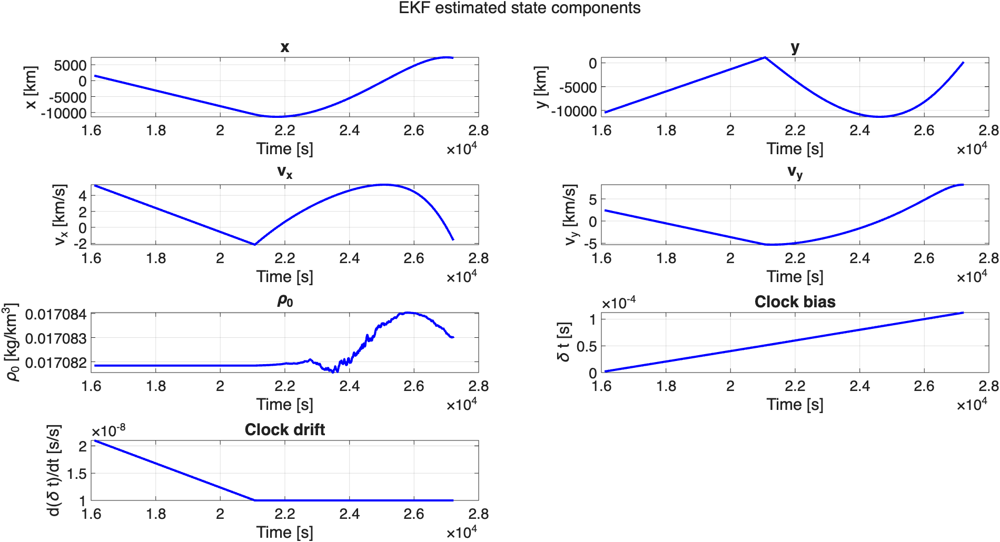
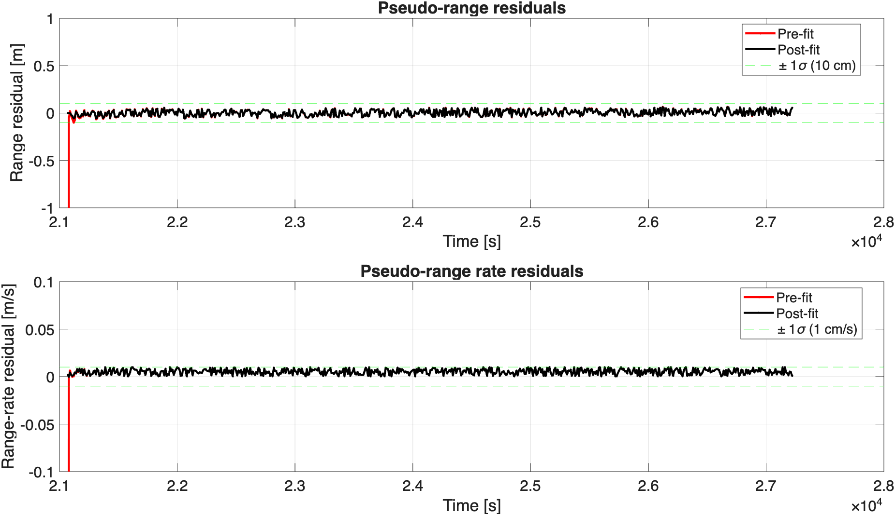
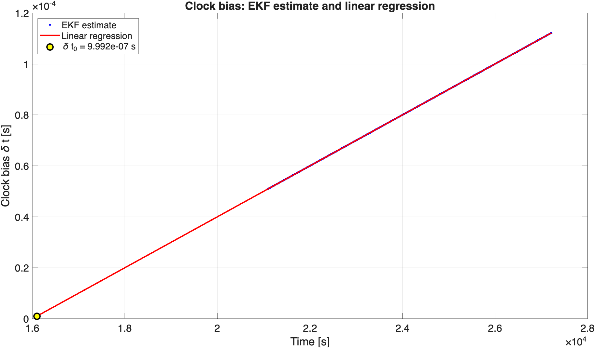
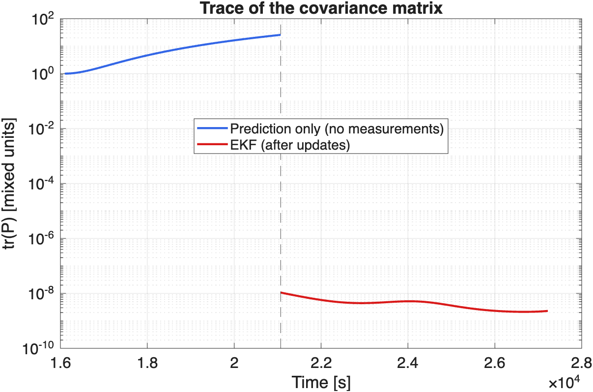

# Orbit Determination Challenge: Batch Least Squares and Extended Kalman Filter

Coursework project for **Space Missions & Systems** (academic year 2025/2026).
The goal is to estimate the state of an Earth orbiter from tracking data, first with a **batch weighted least-squares** (WLS) filter using ground-station measurements, and then with an **Extended Kalman Filter** (EKF) using GNSS measurements, including the on-board clock.

Everything is implemented in **MATLAB** from scratch (dynamics, state transition matrix, observation models, estimators). The full derivations, tables and discussion are in the report [`Caroletta_Challenge.pdf`](Caroletta_Challenge.pdf).

> The original problem statement is course material and is not included in this repository. The section below summarizes it.

---

## The problem

An Earth orbiter is tracked during its commissioning phase and then navigates autonomously. The challenge has two phases.

### Dynamical model (common to all parts)

The spacecraft state is `[x, y, vx, vy]` in an inertial Earth-centered frame, in the orbital plane. The Earth and its atmosphere are **non-rotating**. Two accelerations act on the spacecraft:

- **Earth gravity**, monopole term only: `a_grav = -μ r / |r|³`
- **Atmospheric drag**: `a_drag = -½ ρ(z) C_D (A/m) V² V̂`

| Parameter | Value |
|---|---|
| Drag coefficient `C_D` | 2 |
| Cross-sectional area `A` | 25 m² |
| Mass `m` | 1000 kg |
| Density model | `ρ(z) = ρ(z₀) exp(-(z - z₀)/H)` |
| Reference altitude `z₀` / scale height `H` | 300 km / 14.7 km |
| `μ` (Earth) / Earth radius | 3.986004418×10⁵ km³/s² / 6378 km |

The orbit is elliptical, starting almost at perigee (about 300 km altitude, apogee altitude about 6000 km, eccentricity about 0.30; derived from the a priori state).

### Phase 1: commissioning, ground-station tracking (Parts 1 to 3)

A ground station at angular position **225°** measures **range** and **range rate** (expected accuracy 1 cm and 1 mm/s). The a priori state at `t₀ = 0` is:

| Component | A priori value | A priori uncertainty |
|---|---|---|
| `x` | 4.7230591×10³ km | 10 m |
| `y` | 4.7210591×10³ km | 10 m |
| `vx` | -6.2288709 km/s | 1 m/s |
| `vy` | 6.2283709 km/s | 1 m/s |
| `ρ(z₀)` | 1.808×10⁻² kg/m³ | 0.1 kg/km³ |

Questions:

1. Estimate the five state components (position, velocity, atmospheric density) and their uncertainties at `t₀ = 0` using both observables.
2. Which of the two observables is more valuable for the orbit determination?
3. Add the drag coefficient `C_D` to the estimated vector (a priori value 2.014, accuracy 0.01) and comment on the new solution.

### Phase 2: nominal operations, autonomous navigation with an EKF (Part C)

The ground-station tracking ends. The spacecraft now navigates **on board**, processing the **pseudo-range** and **pseudo-range rate** from the **Galileo E11** satellite (accuracy 10 cm and 1 cm/s).

- E11 moves on a circular orbit in the same plane: `a = 29599.8 km`, `Ω = 77.632°`, `ω = 0°`, `e = 0`, `ν₀ = 15.153°` (at the reference epoch).
- The receiver clock adds two unknowns, bias `δt` and drift `δṫ`, with `δt(t) = δt₀ + δṫ (t - t₀,GNSS)` and `t₀,GNSS = 16100 s`. The speed of light is `c = 299792.458 km/s`.
- The dynamical model is **not changed**. The a priori information is the final result of Part 1 with its **full covariance matrix**, plus clock values given by the problem.

Tasks:

- **C1**: estimate the 7-component state with an EKF; plot the state and the residuals versus time.
- **C2**: from the clock bias timeline, obtain `δt₀` at `t₀,GNSS` by linear regression.
- **C3**: plot the trace of the covariance matrix versus time.

---

## Approach

### Parts 1 to 3: batch weighted least squares

- State `X = [x, y, vx, vy, ρ(z₀)]` (plus `C_D` in Part 3), propagated with `ode113` (`RelTol = AbsTol = 1e-13`) together with the **state transition matrix**, obtained from the analytical Jacobian of the dynamics (gravity gradient plus drag derivatives).
- Computed observables: range and range rate between the spacecraft and the station.
- Iterated WLS with a priori information (normal equations built from the mapping matrix `H̃ = ∂G/∂X · Φ`), until convergence.
- The first run with the putative accuracies (1 cm, 1 mm/s) gives an unacceptable sum of squared residuals (SOS ≈ 9×10⁴). The real accuracies from the residual RMS are one order of magnitude worse (1.043×10⁻⁴ km, 1.005×10⁻⁵ km/s). With them the SOS drops to ≈ 8.7×10², which indicates a consistent solution.
- Question 2 is answered by running the estimator twice, using only range and only range rate, and comparing the uncertainties.

### Part C: Extended Kalman Filter

- **State** `X = [x, y, vx, vy, ρ(z₀), δt, δṫ]` (7 components); the Jacobian is the 5×5 block of Part 1 extended with the clock block.
- **GNSS ephemeris** computed analytically from the circular orbit of E11.
- **Observation model** (pseudo-range and pseudo-range rate):

  ```
  ρ̃  = ρ + c δt
  ρ̃̇  = (Δx Δvx + Δy Δvy) / (ρ + c δt) + c δṫ ,   ρ = sqrt(Δx² + Δy²)
  ```

  with `Δ` the spacecraft minus GNSS differences. The mapping matrix `H̃` (2×7) is derived analytically.
- **A priori**: the Part 1 estimate and covariance are propagated from `t = 0` to `t₀,GNSS` with `P = Φ P₀ Φᵀ` (correlations kept); the clock parameters are appended as uncorrelated.
- **Filter loop**: state and STM integration between epochs (STM reset to identity at each step), Kalman gain, update of state and covariance, pre-fit and post-fit residuals. No process noise, since the dynamical model is unchanged. The first measurement is at 21070 s, so the first step is a pure 4970 s prediction.
- **C2**: least-squares line through the estimated clock bias, with time referred to `t₀,GNSS`, so the intercept is `δt₀`.
- **C3**: trace of `P`, including the prediction-only phase before the first measurement.

---

## Results

### Part 1: state estimate at t = 0 (with realistic measurement accuracies)

| Parameter | Estimate | 1σ uncertainty |
|---|---|---|
| `x₀` [km] | 4.722060×10³ | 1.526×10⁻⁴ |
| `y₀` [km] | 4.722059×10³ | 1.546×10⁻⁴ |
| `vx₀` [km/s] | -6.228771 | 1.434×10⁻⁷ |
| `vy₀` [km/s] | 6.228771 | 1.451×10⁻⁷ |
| `ρ(z₀)` [kg/km³] | 1.708184×10⁻² | 3.665×10⁻⁶ |

Residuals after 5 iterations with the putative accuracies (top, rejected) and with the actual accuracies (bottom, accepted):

<p align="center">
  
  
</p>
<p align="center">
  
  
</p>

### Part 2: which observable is more valuable?

| Parameter | 1σ, range only | 1σ, range rate only |
|---|---|---|
| `x₀` [km] | 1.527×10⁻⁴ | 4.841×10⁻³ |
| `y₀` [km] | 1.546×10⁻⁴ | 5.263×10⁻³ |
| `vx₀` [km/s] | 1.434×10⁻⁷ | 4.741×10⁻⁶ |
| `vy₀` [km/s] | 1.451×10⁻⁷ | 5.091×10⁻⁶ |
| `ρ(z₀)` [kg/km³] | 3.665×10⁻⁶ | 4.201×10⁻⁴ |

**Range is the more valuable observable**: its uncertainties are about 30 times smaller on the position and about 100 times smaller on the density.

### Part 3: drag coefficient added to the estimated vector

| Parameter | Estimate | 1σ uncertainty |
|---|---|---|
| `x₀` [km] | 4.722060×10³ | 1.526×10⁻⁴ |
| `y₀` [km] | 4.722059×10³ | 1.546×10⁻⁴ |
| `vx₀` [km/s] | -6.228771 | 1.434×10⁻⁷ |
| `vy₀` [km/s] | 6.228771 | 1.451×10⁻⁷ |
| `ρ(z₀)` [kg/km³] | 1.696310×10⁻² | 8.430×10⁻⁵ |
| `C_D` | 2.014000 | 9.999996×10⁻³ |

The orbital components do not change. `C_D` stays at its a priori value, so the data do not separate it from the density (they enter the drag acceleration as a product), and the uncertainty of `ρ(z₀)` becomes more than 20 times larger (3.7×10⁻⁶ → 8.4×10⁻⁵ kg/km³).

<!-- TODO: regenerate the Part 3 residual plots with Challenge_part3.m, save them in Figures/ and uncomment:
<p align="center">
  
  
</p>
-->

### Part C1: EKF with GNSS measurements

Estimated state components (the straight segment between 16100 s and 21070 s only joins the a priori and the first estimate, because there are no measurements in that interval):

<p align="center">
  
</p>

Pre-fit and post-fit residuals, with the ±1σ measurement accuracies (dashed):

<p align="center">
  
</p>

| Quantity | Value | Measurement accuracy |
|---|---|---|
| Post-fit RMS, pseudo-range | 3.0 cm | 10 cm |
| Post-fit RMS, pseudo-range rate | 5.9 mm/s | 1 cm/s |

The large first pre-fit residual (about -16.7 km on the range) comes from the error on the a priori clock drift, accumulated over the 4970 s of pure prediction. The density `ρ(z₀)` is practically not observable from GNSS data (the drag is negligible at these altitudes), and its estimate stays within about 1σ of the a priori value.

### Part C2: clock bias regression

<p align="center">
  
</p>

| Parameter | Value |
|---|---|
| Clock bias at `t₀,GNSS = 16100 s`, `δt₀` | 9.992×10⁻⁷ s (`c δt₀` ≈ 0.30 km) |
| Clock drift (slope) | 1.0000×10⁻⁸ s/s |
| A priori values | 2×10⁻⁶ s and 2.1×10⁻⁸ s/s |

### Part C3: trace of the covariance matrix

<p align="center">
  
</p>

Before the first measurement the trace grows (from 1 to about 26) because of the large uncertainty on the clock drift. The first update reduces it by more than nine orders of magnitude, since the range determines the clock bias immediately. The final value is about 2.3×10⁻⁹ (mixed units, dominated by the position variance).

---

## Repository structure

```
.
├── Caroletta_Challenge.pdf      # Full report: derivations, results, discussion
├── Figures/                     # Plots used in this README and in the report
├── Matlab/
│   ├── Challenge_part1.m        # Parts 1-2: batch WLS, 5-component state
│   ├── Challenge_part3.m        # Part 3: batch WLS with C_D in the state vector
│   └── Challenge_partC.m        # Part C: 7-state EKF with GNSS and clock
└── Observables/
    ├── observables.txt          # Ground-station range and range rate (Parts 1-3)
    └── observables_gnss.txt     # GNSS pseudo-range and pseudo-range rate (Part C)
```

Data files: columns are time [s], range or pseudo-range [km], and range rate or pseudo-range rate [km/s]. The ground-station data cover two visibility passes; the GNSS file has 616 epochs, one every 10 s, from 21070 s to 27220 s.

## How to run

Requirements: MATLAB (developed with R2026a; R2018b or later is needed for `xline`, `yline` and `sgtitle`). No toolboxes are required.

From the repository root, in the MATLAB command window:

```matlab
run('Matlab/Challenge_part1.m')   % Parts 1-2
run('Matlab/Challenge_part3.m')   % Part 3
run('Matlab/Challenge_partC.m')   % Part C (EKF, regression, covariance trace)
```

`run` executes each script from its own folder, and the scripts read the data from `../Observables/`. Each script prints its tables in the command window and produces the plots.

`Challenge_part1.m` also prints the final state and covariance propagated to `t₀,GNSS` in a copy-and-paste format. Those values are the a priori of `Challenge_partC.m` (section `FILTER CODE`).

## Skills demonstrated

- Orbital dynamics with atmospheric drag and numerical integration (`ode113`, tight tolerances)
- State transition matrix and analytical Jacobians
- Batch weighted least squares with a priori information, residual and SOS analysis
- Observability analysis (range versus range rate, `C_D` versus density correlation)
- Extended Kalman Filter for GNSS-based autonomous navigation, with receiver clock estimation
- Covariance propagation and analysis

## Author

**Francesco Caroletta** · [LinkedIn](https://www.linkedin.com/in/francesco-caroletta-a569852a6) · [GitHub](https://github.com/FrancescoCaro) · [Email](mailto:francecaroletta@gmail.com)

